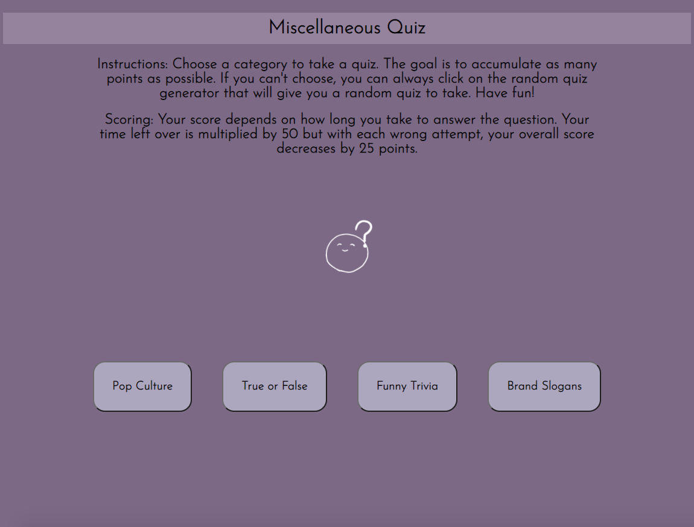

# Miscellaneous-Quiz
## Objective 
+ Create a quiz game that contain four random categories to choose from.

## Getting Started:
### Click [here](https://zmewa079.github.io/Miscellaneous-Quiz/) to take the quiz.

## Motivation:
#### I've always enjoyed playing trivia games. I want to create a quiz where instead of having one topic to choose from, there will be several. More fun topics definetily equate to more fun and that was the goal. 

## View:
### My initial wireframe:

### Final outlook of the quiz:

## Technology Implemented:
+ HTML
+ CSS
+ JavaScript
+ Git

## Pseudocode:
+ Define variables and cached elements needed for each of the quiz
+ Create a button for each quiz
+ Create a function for each quiz
+ Create arrays within each function that include: question, answer choices, correct answer
+ Add scoring mechanics that keep track of points obtained
+ Add a timer to each question 
+ Add main page/reset button to return to page with quiz categories
+ Add an array that will hold all the quizzes 
+ Display function to display the quiz when clicked upon
+ Hide the content of each quiz from main html if it is not clicked

## Credits:
+ Background transparent image from [Giphy](https://giphy.com/stickers/dfb-teams-3liga-3-liga-dritte-v2gKgwk8OfT83ZxzyU) 

## Stretch Goals:
+ ~~add randomizing quiz button~~
+ add background image to each quiz
+ add an animate timer
+ add mobile responsiveness 
+ add sound to each button
