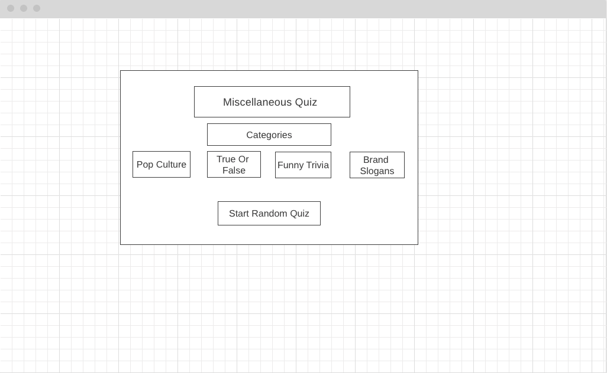

# Miscellaneous-Quiz
## Objective 
+ Create a quiz game that contain four random categories to choose from.

## To take the quiz:
### Click [here](https://zmewa079.github.io/Miscellaneous-Quiz/) to take the quiz.

## Motivation:
#### I've always enjoyed playing trivia games. I want to create a quiz where instead of having one topic to choose from, there will be several. More fun topics definetily equate to more fun and that was the goal. 

## View:
### My initial wireframe:

### Final outlook of the quiz:

## Technology Implemented:
+ HTML
+ CSS
+ JavaScript
+ Git

## Stretch Goals:
+ ~~add randomizing quiz button~~
+ add background image to each quiz
+ add an animate timer
+ add mobile responsiveness 
+ add sound to each button
